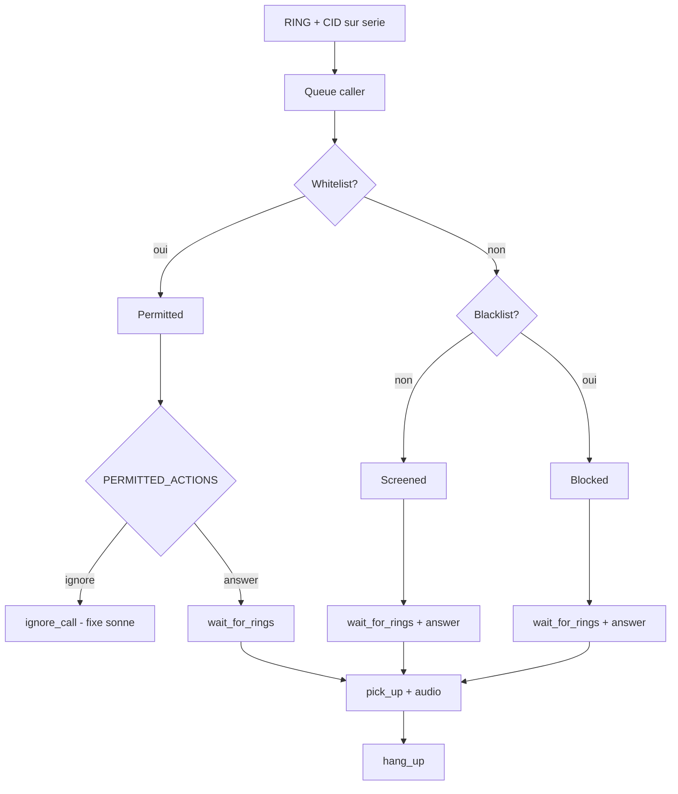

# Architecture Call Attendant (detail)

Complement de [CALLATTENDANT_ETUDE.md](CALLATTENDANT_ETUDE.md).

---

## Vue d'ensemble

```
+------------------+     +------------------+
|  Telephone fixe  |     |  Modem USB       |
|  (parallele)     |     |  USR5637         |
+--------+---------+     +--------+---------+
         |                        |
         +----------+-------------+
                    |
              Ligne analogique
                    |
         +----------+----------+
         |  Raspberry Pi       |
         |                     |
         |  +---------------+  |
         |  | Modem thread  |  |  readline RING/CID
         |  +-------+-------+  |
         |          | queue    |
         |  +-------v-------+  |
         |  | CallAttendant |  |  screening + actions
         |  +-------+-------+  |
         |          |          |
         |  +-------v-------+  |
         |  | Flask webapp  |  |  :5000
         |  +---------------+  |
         |  +---------------+  |
         |  | SQLite DB     |  |
         |  +---------------+  |
         +---------------------+
```

---

## Threads et synchronisation

| Composant | Thread | Synchronisation |
|-----------|--------|-----------------|
| `Modem._call_handler` | Dedie | `threading.RLock` sur commandes AT |
| `CallAttendant.run` | Principal | `queue.Queue` callers, `threading.Event` stop |
| Flask | Thread separe | Demarre dans `webapp.start()` |

Le modem **ne bloque pas** le thread principal pendant les RING : il pousse les appels dans la queue quand le CID est complet.

`pick_up()` acquiert le lock modem et **ne le relache qu'apres** `hang_up()`. Toute la session (greeting + VM) est atomique cote serie.

---

## Etats modem (simplifie)

```
                    +-------------+
                    |  ON-HOOK    |
                    |  (veille)   |
                    +------+------+
                           |
              CID complet + screening
              + action "answer"
                           |
                           v
                    +-------------+
                    |  pick_up()  |
                    |  FCLASS=8   |
                    |  VLS=1      |
                    +------+------+
                           |
              +------------+------------+
              |            |            |
              v            v            v
           VTX play    VRX record   DTMF wait
              |            |            |
              +------------+------------+
                           |
                           v
                    +-------------+
                    |  hang_up()  |
                    |  ATH0       |
                    +-------------+
```

En mode `ignore` (permitted), la machine reste en **ON-HOOK** : aucune transition vers `pick_up()`.

---

## Sequence AT (decrochage Call Attendant)

Ordre exact dans `pick_up()` :

```
AT+FCLASS=8
AT+VSD=128,0        # USR — desactive detection silence modem
AT+VLS=1            # off-hook TAD
```

Pas de :

- `ATA` (reponse classique data/voice)
- `ATH1` (sauf chemins erreur ailleurs)

Playback (`play_audio`) re-envoie FCLASS, VSM, VLS, puis `AT+VTX` jusqu'a CONNECT.

Enregistrement (`record_audio`) : FCLASS, VSM, VSD off, VLS, bip VTS, `AT+VRX` CONNECT.

---

## Marqueurs DLE (modem -> host)

| Code | Signification |
|------|----------------|
| DLE-s (`\x10s`) | Silence detecte |
| DLE-h / DLE-H | Crochet local (tel parallele decroche) |
| DLE-b | Occupation |
| DLE-R | Ring (dans flux voix) |
| DLE ETX | Fin transmission voix |

Call Attendant arrete l'enregistrement sur ces evenements (parallel phone pickup = arret VM).

---

## Base de donnees

SQLite `callattendant.db` dans `DATA_PATH` (`~/.callattendant` par defaut) :

- Journal appels
- Whitelist / blacklist
- Metadonnees messages vocaux

---

## GPIO (optionnel)

LEDs via `hardware/indicators.py` :

- Ring, Approved (permitted), Blocked, Message count (7 segments).

Non requis au fonctionnement logiciel.

---

## Packaging

- Installation : `pip install callattendant`
- CLI : `callattendant --create-folder` puis `callattendant`
- Config : `~/.callattendant/app.cfg` (Python syntax)

---

## Diagramme decision appel entrant


