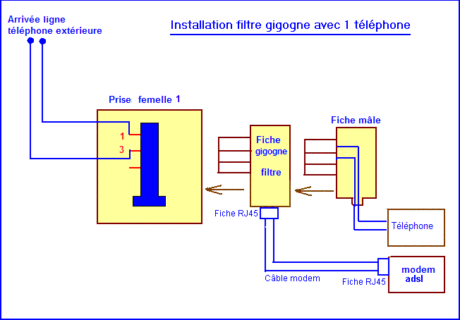

# Telephonie : API principale + daemon (modem)

## Cablage physique (site actuel)

Branchement analogique constate sur l'installation :

**Ligne telephone exterieure -> prise murale -> filtre ADSL (fiche gigogne) -> telephone**
**et modem USB VocalGuard branche sur le filtre** (sortie voix / pass-through telephone).

```
Arrivee ligne
      |
Prise femelle murale (broches 1 et 3)
      |
Fiche gigogne filtre ADSL
      |-- Fiche RJ45 / cable modem -> modem ADSL (donnees / box)
      |-- Sortie voix (fiche telephone) -> modem USB VocalGuard
      |                              -> telephone (si present en parallele)
```

Reference visuelle (filtre gigogne + 1 telephone) :



Notes :

- Le filtre separe la voix (pass-through) et les donnees ADSL (sortie RJ vers la box).
- Le **modem USB VocalGuard** (USR / Conexant, port serie `/dev/ttyACM*` ou symlink `/dev/modem56k`) est branche **sur le filtre**, cote voix. C'est par la que le daemon voit les RING, le Caller ID et l'audio ligne.
- Telephone en parallele : le repondeur modem peut couper la sonnerie (`rings_before_answer: 0`) ou laisser le fixe gerer (`incoming_auto_answer: false` / mode UI Telephone).

## Logiciel : API + daemon

Deux roles possibles :

| Processus | Role |
|-----------|------|
| **API FastAPI** (`backend.main` / `backend.api.app`) | REST, WebSocket `/ws/events`, ingestion `POST /api/v1/internal/telephony-events`, proxy HTTP vers le daemon pour les appels sortants si `USE_TELEPHONY_DAEMON=1`. |
| **Daemon telephonie** (`backend.telephony_daemon.main`, port **8090** par defaut) | Modem serie, `CallManager`, sessions sortantes, WebSocket **`/ws/outgoing-call/{id}/audio`**, relais des evenements bus -> API via POST interne. |

Sur une meme machine (ex. Raspberry Pi), les deux peuvent coexister avec `TELEPHONY_DAEMON_URL=http://127.0.0.1:8090`.

## Modes ligne entrante

| Mode | Comportement |
|------|----------------|
| **Repondeur** (`incoming_auto_answer: true`, UI Repondeur) | Decrochage **immediat** si `rings_before_answer: 0` (seize voix) ; CID en parallele / via ATA ; message d'accueil + enregistrement. |
| **Telephone** (`incoming_auto_answer: false`, UI Telephone) | Journalise l'appel + CID, pas de ATA ; le fixe sonne ; fin des RING detectee sans sleep fixe. |
| **Planning** (`incoming_line_schedule` dans YAML) | Si `enabled: true`, ecrase le switch UI sur des creneaux (voir `config.example.yaml`). |
| **Whitelist ring-only** | Si `whitelist_ring_only: true`, un numero en liste blanche sonne au fixe sans ATA modem. |

Switch UI : topbar -> `PUT /api/v1/settings/incoming-line-mode` (persiste dans `data/incoming_line_mode.yaml`).

## Reference Call Attendant (projet amont)

VocalGuard s'inspire du meme materiel (USR5637, ligne en parallele) que [emxsys/callattendant](https://github.com/emxsys/callattendant). Call Attendant **ne decroche pas au RING** tant que l'action est `ignore` (numeros autorises) : le fixe sonne normalement. VocalGuard reproduit ce comportement en mode **Telephone** et coupe le fixe en mode **Repondeur** (seize immediat + `ATA` pour les operateurs FR).

| Document | Contenu |
|----------|---------|
| [CALLATTENDANT_ETUDE.md](CALLATTENDANT_ETUDE.md) | Etude complete : flux, config rings/actions, modem, screening |
| [CALLATTENDANT_ARCHITECTURE.md](CALLATTENDANT_ARCHITECTURE.md) | Threads, etats modem, sequences AT, diagrammes |
| [CALLATTENDANT_VS_VOCALGUARD.md](CALLATTENDANT_VS_VOCALGUARD.md) | Comparatif : pourquoi le fixe sonne ou non, equivalences de config |
| [plans/README.md](plans/README.md) | **Roadmap** : policy, config parametrable, UI Material, sprints |

## Sante et diagnostic

| Endpoint | Role |
|----------|------|
| `GET http://node14.lan:8090/health` | Daemon : **200** si modem init, **503** sinon. Champs : `firmware_ati3`, `last_cid_raw`, `last_ring_at`, `relay_failures`, mode ligne. |
| `GET http://node14.lan:8000/health` | API : ping daemon si `USE_TELEPHONY_DAEMON=1` (`telephony_daemon_reachable`, snapshot modem). |
| `GET /api/v1/telephony/status` | Pastille topbar (proxy daemon depuis l'API). |

Boot modem typique (daemon) : `AT`, `ATE0`, `AT+FCLASS=0`, `AT+PCW=0` (option), `AT+VCID=1`, `ATI3`, eventuellement `AT+GCI=3D` (France).

## Config utile (YAML / env)

Voir `config/config.example.yaml`. Exemples :

- `cid_wait_sec` / `CID_WAIT_SEC` : fenetre CID avant ATA (meme en coupe-sonnerie).
- `modem_country_gci` / `MODEM_COUNTRY_GCI` : code pays (France `3D`).
- `modem_voice_vgr` / `modem_voice_vgt` : gains V.253 (null = ne pas envoyer).
- `modem_pcw_off_for_cid` : `AT+PCW=0` au boot pour aider le CID.
- `max_call_duration` : plafond duree appel (applique cote CallManager).
- `mic_vad_rms` / `mic_vad_hangover_ms` : VAD micro sortant.
- `outgoing_use_vtr` : reserve full-duplex ; si true sans support, fallback talkspurt VTX.

## Variables d'environnement (resume)

| Variable | Ou | Role |
|----------|-----|------|
| `USE_TELEPHONY_DAEMON` | API principale | `1` : pas d'ouverture du modem dans ce processus ; proxification des routes sortantes vers `TELEPHONY_DAEMON_URL`. **Sur le service `vocalguard-telephony`, cette valeur est ignoree** (le daemon traite toujours les appels en local). |
| `TELEPHONY_DAEMON_URL` | API principale | URL du daemon (ex. `http://node14.lan:8090`). |
| `TELEPHONY_PUBLIC_API_URL` | **Daemon** | URL joignable **depuis le Pi** vers l'API qui recoit les evenements. |
| `TELEPHONY_INTERNAL_TOKEN` | API + daemon | Meme secret pour l'en-tete `X-VocalGuard-Internal` sur `/internal/telephony-events`. |
| `TELEPHONY_BIND_HOST` / `TELEPHONY_BIND_PORT` | Daemon | Ecoute (defaut unit : `0.0.0.0:8090` sur le LAN). |
| `TELEPHONY_RELAY_WARN_INTERVAL_SEC` | Daemon (optionnel) | Limite la frequence des logs d'echec du relais HTTP (defaut 30 s). |

## Developpement : PC Windows + modem sur le Pi

1. **Backend local** : `USE_TELEPHONY_DAEMON=1`, `TELEPHONY_DAEMON_URL=http://<pi>:8090`.
   L'API locale **ne tente plus** d'ouvrir `/dev/ttyACM0` dans ce mode.

2. **Frontend** : pour entendre la ligne dans le navigateur, la session audio vit sur le daemon. Definir dans `frontend/.env.local` :
   ```env
   NEXT_PUBLIC_TELEPHONY_WS_BASE=ws://node14.lan:8090
   ```
   (`NEXT_PUBLIC_*` : redemarrer `next dev` apres modification.)

3. **Jeton** : `TELEPHONY_INTERNAL_TOKEN` aligne entre `.env` local et `.env` du Pi pour les POST internes.

## Deploiement daemon seul

```powershell
.\scripts\deploy_telephony.ps1 -AppServerName node14.lan
```

Synchronise le depot (sans `frontend/`), copie `.env.prod` -> `.env` distant, `pip`, service `vocalguard-telephony`. Bind LAN par defaut `0.0.0.0:8090`.

## Verifications HTTP

- Script portable : `python scripts/test_api_stack.py` (racine du depot).
- PowerShell : `.\scripts\run_telephony_tests.ps1 -Mode Stack -RemoteHost node14.lan`
- Smoke Linux : `bash scripts/smoke_telephony_stack.sh` (echoue si `modem_initialized` faux).
- Lab CID (modem branche) : `python scripts/modem_lab_cid_wait.py --port /dev/modem56k --wait 20`

Voir aussi `backend/telephony_daemon/README.md`.

## Checklist ops (CID / modem)

- **CID manquant** : verifier service Caller ID operateur ; firmware `ATI3` (hint 1.2.23) dans `GET :8090/health` ; `AT+PCW=0` + `AT+VCID=1` au boot ; augmenter `cid_wait_sec` ; lire `last_cid_raw` (O/P = masque, pas un bug).
- **OK apres ATD != connecte** : en voix, `OK` = composition acceptee ; l'etat "en ligne" attend un connect / reponse ulterieure.
- **DLE escape** : les octets PCM `0x10` sont doubles avant VTX (sinon session V.253 cassee).
- **Telephone parallele** : si le fixe decroche pendant l'accueil, le playback VTX s'interrompt (DLE hook / marqueurs) et le repondeur s'arrete.
- **Pastille UI** : `GET /api/v1/telephony/status` (modem OK/KO, firmware, dernier CID).
- Reference AT complete : [MODEM_USR5637.md](MODEM_USR5637.md).
- Ligne parallele / fixe qui sonne : [CALLATTENDANT_VS_VOCALGUARD.md](CALLATTENDANT_VS_VOCALGUARD.md).
