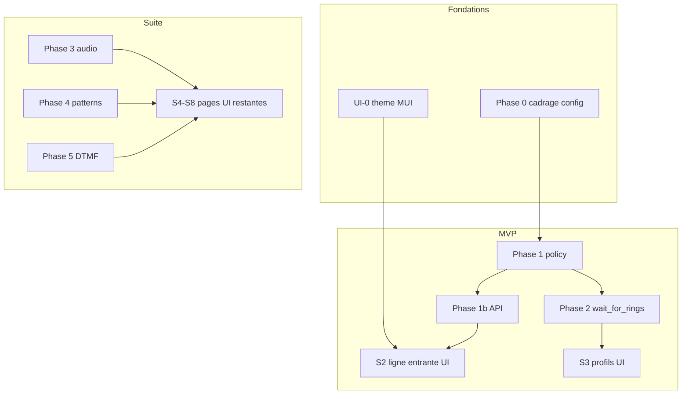

# Plan 04 — Roadmap integree (backend + UI)

Estimation globale :

| Scope | Duree indicative |
|-------|------------------|
| MVP (phases 0–2 backend + UI-0 + S1–S3) | ~6–7 j |
| Complet (toutes phases) | ~12–14 j |

Regle : **livraison par sprint = backend + ecran Material associe**.

---

## Vue d'ensemble

---

## Sprints detailles

### S1 — Fondations (~2 j)

| Backend | Frontend |
|---------|----------|
| Schema YAML `incoming_call` | UI-0 : `vocalguardTheme.ts` + `MuiThemeProvider` |
| Modeles Pydantic + env mapping | Composants `VgPageHeader`, `VgSettingsSection`, `VgSaveBar` |
| Squelette `incoming_call_policy.py` | Hub `/settings` (tuiles Material) |

**Critere succes :** theme MUI actif ; hub settings navigable ; config parse sans erreur.

---

### S2 — Ligne entrante (~1,5 j)

| Backend | Frontend |
|---------|----------|
| API `GET/PUT /settings/incoming-call` (champs ligne) | `/settings/incoming-line` complet |
| `reload_incoming_policy()` | Topbar MUI `ToggleButtonGroup` |
| Presets voicemail / phone | `useIncomingCallConfig` hook |

**Critere succes :** bascule repondeur/telephone via UI et topbar ; reload sans restart daemon.

---

### S3 — Policy et profils (~2 j)

| Backend | Frontend |
|---------|----------|
| Policy engine complet | `/settings/incoming-profiles` (3 onglets) |
| Classification permitted/screened/blocked | `VgActionsBuilder`, `VgRingsSlider` |
| Screening avant seize (whitelist ignore) | `VgEffectiveConfigBanner` |

**Critere succes :** whitelist ne declenche pas ATA ; profils editables et persistes.

---

### S4 — wait_for_rings (~1,5 j)

| Backend | Frontend |
|---------|----------|
| `wait_for_rings` parametrable | Champs ring_cycle / quiet_abort dans avance ou profils |
| Abort si fixe decroche | Preview texte dans UI profils |

**Critere succes :** rings=2 + decrochage fixe ring 1 → modem n'intervient pas.

---

### S5 — Audio (~1 j)

| Backend | Frontend |
|---------|----------|
| Pipeline WAV/TTS configurable | `/settings/incoming-audio` |
| Assets `resources/voice/` | `VgAudioSourcePicker` + preview |

**Critere succes :** accueil WAV joue apres seize ; fallback TTS si fichier absent.

---

### S6 — Patterns et filtrage (~1,5 j)

| Backend | Frontend |
|---------|----------|
| `number_patterns` + API CRUD | `/settings/number-patterns` |
| Integration policy | Refonte `/filtering` MUI |

**Critere succes :** pattern `+338%` bloque sans entree manuelle ; UI filtrage coherente.

---

### S7 — DTMF et modale (~1,5 j)

| Backend | Frontend |
|---------|----------|
| `wait_dtmf_digit` modem | `/settings/voicemail` |
| Config voicemail complete | `IncomingCallModal` MUI Dialog |

**Critere succes :** require_dtmf=true → pas d'enregistrement sans touche 1.

---

### S8 — Finition (~1,5 j)

| Backend | Frontend |
|---------|----------|
| Health `last_decision` | `/calls` chips profil |
| Tests lab modem | `/settings/incoming-advanced` |
| Doc `config.example.yaml` | Dashboard indicateurs |
| | QA responsive + a11y |

**Critere succes :** parcours complet testable en prod node14 ; doc a jour.

---

## Ordre de demarrage recommande

1. UI-0 + Phase 0 (cadrage)
2. S2 (ligne entrante — valeur immediate)
3. S3 (policy — coeur Call Attendant)
4. S4 puis S5–S8

---

## Tests transverses (chaque sprint)

### Modem lab

Scenarios dans `scripts/modem_lab/` :

- Mock RING/CID sans Pi si possible
- Appel reel node14 avant merge prod

### Scenarios fonctionnels

| # | Scenario |
|---|----------|
| 1 | Whitelist ring-only → fixe sonne |
| 2 | Inconnu rings=0 → ATA + accueil |
| 3 | Bloque → message court |
| 4 | Mode telephone → journal seul |
| 5 | Fixe decroche avant N rings → abort |
| 6 | Pattern masque → blocked |
| 7 | DTMF requis → pas de record sans 1 |
| 8 | PUT API → reload live |
| 9 | UI sauvegarde partielle OK |

### Non-regression

- Anti-SFR (ATA rings=0)
- WebSocket appels live
- Raccrochage rapide (Vosk thread)
- Mode telephone fixe sonne

---

## Livrables documentation

| Document | Quand |
|----------|-------|
| `config.example.yaml` commente | S1 |
| `TELEPHONY_STACK.md` section policy | S3 |
| `CALLATTENDANT_VS_VOCALGUARD.md` mise a jour | S8 |
| Ce dossier `docs/plans/` | Maintenu a jour chaque sprint |

---

## Decisions ouvertes (phase 0)

| Question | Proposition par defaut |
|----------|------------------------|
| Patterns : page dediee ou fusion `/filtering` ? | Onglets dans `/filtering`, lien depuis settings |
| Test audio sur modem depuis UI ? | Phase ulterieure (S5+) |
| Presets editables par l'utilisateur ? | Oui via API, UI avance S8 |
| `phone_mode_rings` dans preset phone uniquement ? | Oui, herite par profil permitted/screened en mode phone |

---

## Fichiers cles (index)

### Backend

- `backend/core/incoming_call_policy.py` (nouveau)
- `backend/core/call_manager.py`
- `backend/core/modem_handler.py`
- `backend/core/config.py`
- `backend/api/routes/settings.py`
- `backend/api/models.py`
- `config/config.example.yaml`

### Frontend

- `frontend/src/theme/vocalguardTheme.ts` (nouveau)
- `frontend/src/components/ThemeProviderWrapper.tsx`
- `frontend/src/components/mui/*` (nouveau)
- `frontend/src/components/Topbar.tsx`
- `frontend/src/components/IncomingCallModal.tsx`
- `frontend/src/app/settings/**` (nouveau)
- `frontend/src/app/filtering/page.tsx`
- `frontend/src/app/calls/page.tsx`
- `frontend/src/services/settingsApi.ts`
